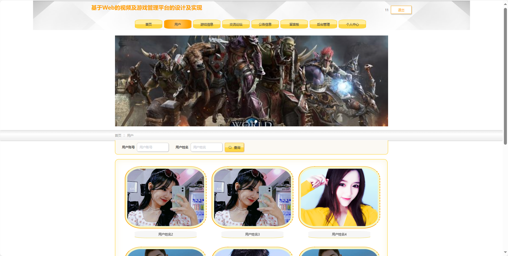
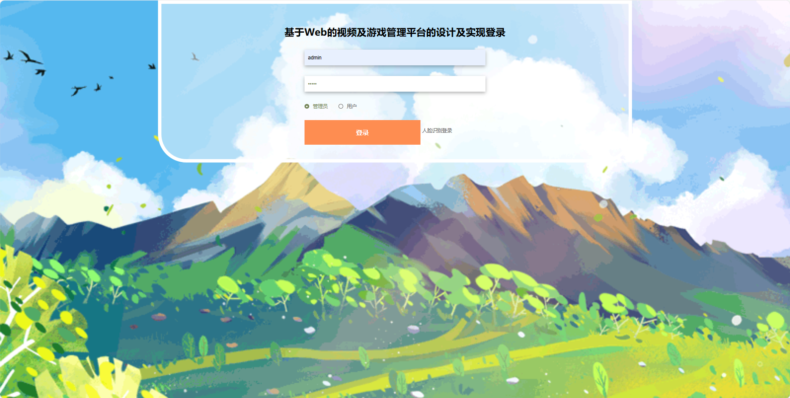

## 基于SpringBoot的视频及游戏管理平台

- <b>完整代码获取地址：从戎源码网 ([https://armycodes.com/](https://armycodes.com/))</b>
- <b>技术探讨、资料分享，请加QQ群：692619798</b> 
- <b>作者微信：19941326836  QQ：952045282</b> 
- <b>承接计算机毕业设计、Java毕业设计、Python毕业设计、深度学习、机器学习</b>
- <b>选题+开题报告+任务书+程序定制+安装调试+论文+答辩ppt 一条龙服务</b>
- <b>所有选题地址 ([https://github.com/YuLin-Coder/AllProjectCatalog](https://github.com/YuLin-Coder/AllProjectCatalog)) </b>

## 项目介绍
基于SpringBoot的视频及游戏管理平台，系统包含两种角色：管理员、用户主要功能如下。

### 【管理员】:
系统首页：查看视频及游戏管理平台整体概况和关键数据。
个人中心：修改密码、管理个人信息。
用户管理：审核和管理注册用户的信息。
游戏分类管理：管理平台上游戏的分类信息。
游戏信息管理：监管和管理平台上游戏的详细信息等。
好友信息管理：管理用户间的好友关系，等。
留言板：查看和管理用户在留言板上的留言。
交流论坛：监管和管理平台上的交流论坛等。
系统管理：管理系统的基本设置。

### 【用户】:
首页：浏览视频及游戏管理平台的主要信息。
用户：查看和编辑个人信息，包括用户名、头像等。
游戏信息：浏览平台上的游戏信息，包括详情和评价。
交流论坛：参与用户间的讨论和交流。
公告信息：阅读系统发布的相关通知和公告。
留言板：留下对游戏或系统的留言和反馈。
后台管理：进行系统首页、个人中心、好友信息管理等操作。

## 项目技术
- 编程语言：Java
- 数据库：MySQL
- 项目管理工具：Maven
- 前端技术：HTML、CSS、JavaScript、Jquery、Vue
- 后端技术：Spring、SpringMVC、MyBatis

## 运行环境
- JDK版本：JDK1.8及以上
- 开发工具：IDEA、Ecplise、Myecplise都可以
- 数据库: MySQL5.7及以上
- Maven：maven3.0及以上
- Node：14.14.0及以上

## 运行截图

